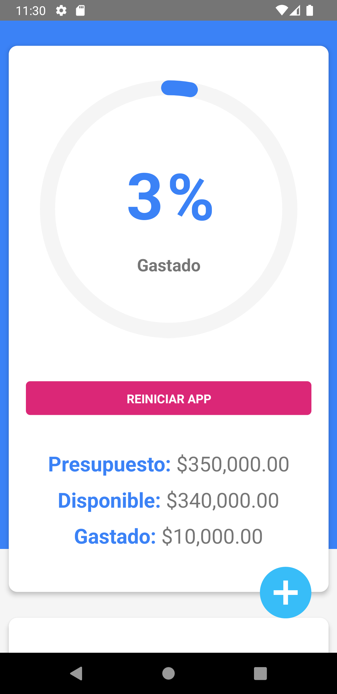

# Expense-Planner
This expense planner allows you to generate a budget and add expenses to it.

To edit and work in this app run the command: 

**npx react-native init planificador**

Then, replace the scr folder and the APP.js in your project folder planificador.

If you want to use the APP just download the app-release.apk in the release folder

# Libraries

This project has the next libraryes:

1. react-native-picker/picker
2. eklipse-react-native-circular-progress
3. react-native-async-storage/async-storage

***Don't forget to install all the libraries to run the project***

# Images

 &nbsp;&nbsp;&nbsp;&nbsp;
 &nbsp;&nbsp;&nbsp;&nbsp; 
 &nbsp;&nbsp;&nbsp;&nbsp;  
 
 
 &nbsp;&nbsp;&nbsp;&nbsp;
 &nbsp;&nbsp;&nbsp;&nbsp;
 &nbsp;&nbsp;&nbsp;&nbsp;

 &nbsp;&nbsp;&nbsp;&nbsp;
 &nbsp;&nbsp;&nbsp;&nbsp; 
 &nbsp;&nbsp;&nbsp;&nbsp;  
 
 
 &nbsp;&nbsp;&nbsp;&nbsp;
 &nbsp;&nbsp;&nbsp;&nbsp;
 &nbsp;&nbsp;&nbsp;&nbsp;
